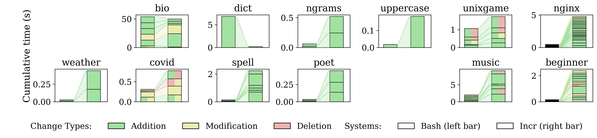
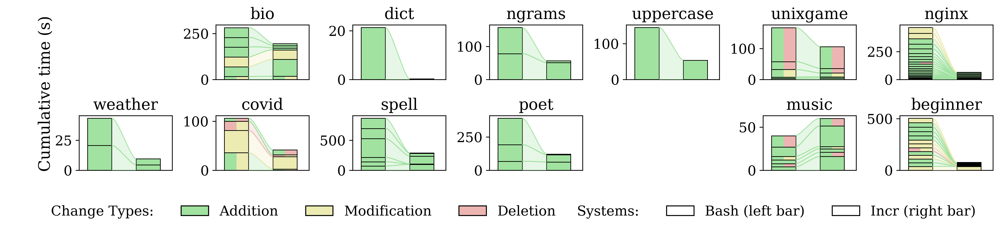
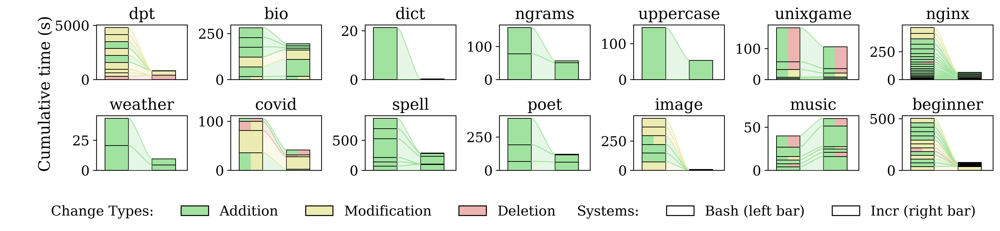

# Overview  
The paper makes the following claims that are relevant to artifact evaluation on page 2:  

1. **Fine-grained dependency tracking**: Incr introduces lightweight interposition probes that capture interactions across the filesystem, shell environment, and other external resources.
2. **Correct incrementalization via memoization**: Incr enables incrementalization by memoizing dependencies and effects, including both transient data streams and side effects, and safe reuse of prior effects.
3. **Runtime optimizations**: Incr introduces a series of runtime optimizations, including eager stream processing, introspection, and compaction.
4. **Optional tuning interface**: Incr optionally accepts crowdsourced annotations and developer configurations to enhance, disable, or relax parts of incrementalization.

This artifact targets the following badge (mirroring [the OSDI26 artifact "evaluation process"](https://www.usenix.org/conference/osdi26/call-for-artifacts)):  

- [ ] [Artifact available](#artifact-available): Reviewers are expected to confirm public availability of core components (~5mins) 

<!-- Additionally, we provide complete instructions to confirm that
* Incr is [functional](#artifact-functional): functional executables verified via a miniam "Hello world" example (~10mins).
* Results presented in the papers are [reproducible](#results-reproducible): Incr's efficient incrementalization of diverse shell programs, demonstrated by its performance compared to Bash (Fig.4, ~x hours).  -->


<a id="artifact-available"></a>
# Artifact Available (~5 mins)
Confirm that the paper, code, and automation scripts are all publicly available:

1. The artifact code is hosted on [GitHub](https://github.com/atlas-brown/incr).
2. The artifact is archived in [Zenodo's permanent archive](https://zenodo.org/records/19488791).

The current repository includes:

1. the Incr implementation under [src](./src),
2. the top-level project overview in [README.md](./README.md),
3. the executable entrypoint [incr.sh](./incr.sh),
4. the benchmark drivers under [evaluation/benchmarks](./evaluation/benchmarks),
5. the Bash behavioral-equivalence harness under [evaluation/bash-ts](./evaluation/bash-ts).

<!-- Confirm sufficient documentation, key components as described in the paper, and the system's exercisability. -->

<!-- **Documentation:** The repository contains the core implementation and the main evaluation entry points:

* [src/main.rs](./src/main.rs): CLI entrypoint that selects an execution strategy for each command.
* [src/command.rs](./src/command.rs): represents a command invocation and handles spawning child processes.
* [src/config.rs](./src/config.rs): runtime and compile-time configuration constants.
* [src/execution](./src/execution): execution engines that manage tracing, caching, and replaying command results.
* [src/cache](./src/cache): stores and retrieves memoized outputs and file dependency information.
* [src/scripts](./src/scripts): helper scripts for parsing trace output and rewriting shell scripts to use incr.
* [evaluation/benchmarks/run.sh](./evaluation/benchmarks/run.sh): top-level benchmark driver that runs and times each scenario under both Bash and Incr.
* [evaluation/bash-ts/run.sh](./evaluation/bash-ts/run.sh): Bash test-suite comparison harness that checks behavioral equivalence.
* [evaluation/analysis](./evaluation/analysis): plotting and statistics helpers for generating figures. -->

**Completeness:** The current paper claims correspond to the following repository elements:

1. fine-grained dependency tracking and memoization are implemented in the tracing/execution/cache path rooted at [src/main.rs](./src/main.rs), [src/execution](./src/execution), and [src/cache](./src/cache);
2. runtime optimizations such as streaming, batching, chunking, introspection, and compression are reflected by flags in [src/main.rs](./src/main.rs) and constants/configuration in [src/config.rs](./src/config.rs);
3. optional tuning through annotations and developer configuration is represented by [src/annotation](./src/annotation);
4. shell behavioral equivalence is exercised by the Bash test-suite harness in [evaluation/bash-ts/run.sh](./evaluation/bash-ts/run.sh).

> [!IMPORTANT]
> AEC Reviewers: **All following steps are optional.**

<a name="artifact-functional"></a>
# Artifact Functional (~10 mins)

This section explains how to set up an environment to run Incr.

Requirements:
1. Ubuntu 22.04
2. Rust 
3. Python 3 
4. `strace`
5. `mergerfs`
6. `sudo` access for sandboxed paths, so Incr can clean up sandbox mount points after execution.

> Note: Installing directly on a new Ubuntu machine on Cloudlab is the quickest and recommended path. Fall back to Docker if the native installation does not work.

To install Incr on Ubuntu 22.04, run:
```sh
curl -fsSL https://raw.githubusercontent.com/atlas-brown/incr/main/scripts/up.sh | sh
cd incr
```

This bootstrap script installs the required Ubuntu packages (`git`, `mergerfs`, `strace`, `python3-pip`, `curl`, `ca-certificates`, `build-essential`, `pkg-config`, `libssl-dev`, and `libtool`), installs Rust via `rustup` if needed, clones the repository into `~/incr` when run outside an existing checkout, installs Python dependencies, and builds `target/release/incr`.

These setup steps are intended for Ubuntu 22.04 specifically. Newer Ubuntu releases may need extra adjustments because of newer Python packaging and compiler behavior.

Alternatively, we provide a Docker image for running Incr on other operating systems:

```sh
git clone https://github.com/atlas-brown/incr
cd incr
docker build -t incr .
docker run -it --rm --privileged incr
```

To run a "hello world" example:

```sh
bash ./incr.sh ./evaluation/hello-world.sh
```

**Minimal incrementalization example (war-and-peace):** A word-frequency pipeline over a large text.

```sh
bash ./evaluation/war-and-peace/test.sh
```

The script first runs the baseline pipeline with `bash`, then executes Incr twice.
The first Incr run is a cold run.
The second Incr run reuses cached results and should finish faster.
Reviewers should expect both Incr outputs to match the baseline output.

To clean up the generated caches and temporary files:
```bash
bash ./evaluation/war-and-peace/clean.sh
```

<!-- **Invoking incr directly:** You can also wrap a single command. For example:

```sh
./target/release/incr \
  --try "$(pwd)/src/scripts/try.sh" \
  --cache "$(pwd)/test_cache" \
  sort ./evaluation/war-and-peace/book-large.txt | md5sum
```

Without incr, `sort` on this file takes about a second. The output should be `9ef554d5bf475ce2820592f7f9a10e42`. Incr populates `test_cache/` on the first run. Running it again replays the cached result and completes near-instantly. -->

<a name="results-reproducible"></a>
# Results Reproducible (~1--4 hours)

This section describes the two main reproduction paths we recommend for artifact evaluation:

1. **Re-execution performance** (`§7.1`, `Fig. 4`): reproduce Incr's performance on incremental changes across the benchmark suite.
2. **Bash test suite** (`§7.3`): reproduce the behavioral-equivalence checks against Bash.

## Re-execution performance (`§7.1`, `Fig. 4`)

The benchmark harness lives under [evaluation/benchmarks](./evaluation/benchmarks). Its main driver is [evaluation/benchmarks/run_all.sh](./evaluation/benchmarks/run_all.sh).

`run_all.sh` supports:

* `--mode=easy|full`
* `--size=min|small`
* `--run-mode=bash|incr|both`
* `--results-dir=DIR`

The initial quick path is `easy + min`, which runs the 12 benchmarks that do not require complex packages to be installed with tiny inputs. The simple path to reproduce ~80% of the paper's results is `easy + small`, which runs these benchmarks on larger inputs. The full evaluation path is `full + small`, which includes the two more complex benchmarks (`dpt` and `image-annotation`).

### Quick reviewer path (~10 mins)

Running the benchmarks in `min` mode confirms that their dependencies are installed correctly. To run the easier suite with tiny inputs and collect both Bash and Incr timings:

```sh
cd evaluation
bash ./benchmarks/run_all.sh --mode=easy --size=min --run-mode=both
```

This command will:

1. run benchmark setup scripts,
2. execute each benchmark under both Bash and Incr,
3. write timing CSVs and cache-size summaries under `evaluation/run_results/min`, and
4. best-effort clean temporary `/tmp` artifacts and stale overlay mounts between benchmarks.

To print a human-readable timing summary:

```sh
cd evaluation/benchmarks
python3 ./show_results.py --size min
```

To plot the results:

```sh
cd evaluation
python3 ./scripts/perf-bars-color.py
```

This script automatically scans `evaluation/run_results`, plots each available size (for example, `min` or `small`), and writes size-specific PNGs under `evaluation/figs`.

An example plot showing the subset of results using minimal inputs:



### Simple evaluation path (~2 hours, machine dependent)

To run the 12 simple benchmarks with the larger `small` inputs:

```sh
cd evaluation/benchmarks
bash ./run_all.sh --mode=easy --size=small --run-mode=both
```

This path reproduces ~80% of the paper's re-execution performance evaluation, subject to machine differences. Runtime varies substantially by machine; the paper measurements were collected on a CloudLab `m510` machine.

To inspect the aggregated results:

```sh
cd evaluation/benchmarks
python3 ./show_results.py --size small
```

An example plot showing the subset of results using small inputs:



### Full evaluation path (~3.5 hours, machine dependent)

Running the full evaluation requires setting up the `dpt` and `image-annotation` benchmarks. For `dpt`, the run script automatically installs Meta's Segment Anything Model along with its Python dependencies. For `image-annotation`, an OpenAI API key is required and can be configured using `llm keys set openai`. An API key can be provided to reviewers upon request.

To run all 14 benchmarks with the larger `small` inputs:

```sh
cd evaluation/benchmarks
bash ./run_all.sh --mode=full --size=small --run-mode=both
```

This path most closely matches the paper's re-execution performance evaluation, subject to machine differences. Runtime varies substantially by machine; the paper measurements were collected on a CloudLab `m510` machine.

To inspect the aggregated results:

```sh
cd evaluation/benchmarks
python3 ./show_results.py --size small
```

An example plot showing the subset of results using small inputs:



### Notes on benchmark names

The repository benchmark names differ slightly from the names used in the paper:

* `word-freq` corresponds to paper `dict`
* `nlp-ngrams` corresponds to paper `ngram`
* `nlp-uppercase` corresponds to paper `uppercase`
* `unixfun` corresponds to paper `unixgame`
* `nginx-analysis` corresponds to paper `nginx`
* `image-annotation` corresponds to paper `image`

## Bash test suite (`§7.3`)

The Bash behavioral-equivalence harness lives under [evaluation/bash-ts](./evaluation/bash-ts). Its main driver is [evaluation/bash-ts/run.sh](./evaluation/bash-ts/run.sh).

By default, `run.sh` executes a curated subset of tests that covers the main known-sensitive categories while keeping runtime manageable. It:

1. clones the Bash source tree if needed,
2. builds Bash and helper binaries,
3. runs each selected test once under Bash,
4. runs the same test under Incr using that same built Bash via `INCR_SHELL`, with nested `${THIS_SH}` calls routed through a wrapper that always enables the Bash parser, and
5. writes paired outputs to `evaluation/bash-ts/results`.

### Default subset (~5--10 mins)

```sh
cd evaluation/bash-ts
bash ./run.sh
```

This creates files of the form:

* `results/<test>.results.bash`
* `results/<test>.results.incr`

If you want to suppress known non-semantic diff noise such as line-number drift, shell-wrapper names, or injected `incr` prefixes in pretty-printed functions, use:

```sh
cd evaluation/bash-ts
python3 ./filter_diff_noise.py results/run-type.results.incr
```

To inspect whether any paired outputs differ:

```sh
cd evaluation/bash-ts
for f in results/*.results.bash; do
    base="${f%.results.bash}"
    diff -q "$f" "${base}.results.incr" >/dev/null || echo "DIFF ${base##results/}"
done
```

Expected outcome:

* most files should match exactly;
* the paper currently documents two known divergence classes: recursive `alias` definitions and one `execscript` case involving `PATH` being unset.

To run a single named test category, for example `quote`:

```sh
cd evaluation/bash-ts
bash ./run.sh quote
```

### Full suite (~10--20 mins; more representative)

To run all discovered test categories instead of the curated default subset:

```sh
cd evaluation/bash-ts
INCR_BASH_TEST_FULL=1 bash ./run.sh
```

This is substantially longer than the default subset because it runs the full discovered test set under both Bash and Incr.

### Optional category summary

The repository also includes [evaluation/bash-ts/categories.py](./evaluation/bash-ts/categories.py), which summarizes the line counts of the `.right` files grouped by category:

```sh
cd evaluation/bash-ts
python3 ./categories.py
```

This is useful for understanding the coverage categories discussed in the paper, but it is not required for running the equivalence checks.

## Expected outcomes

For re-execution performance:

* `run_all.sh` should populate `evaluation/run_results/<size>`
* `verify_outputs.sh` should report matching outputs for the executed benchmarks;
* `show_results.py` should display per-benchmark Bash and Incr times, along with cache sizes.

For the Bash test suite:

* `run.sh` should populate `evaluation/bash-ts/results`;
* most paired Bash/Incr result files should match exactly;
* any remaining mismatches should be limited to the known divergence classes documented in the paper draft.
