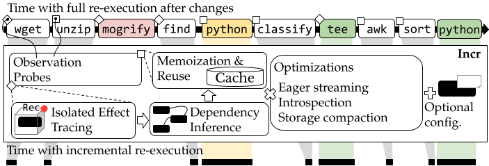

# incr

Quick Jump: [Quick Start](#quick-start) | [Setup](#setup) | [Benchmarks](#benchmarks) | [Citing](#citing-incr) | [License & Contributing](#license--contributing)

Bolt-on incremental execution for the shell. Incr wraps shell commands to track their file dependencies and memoize their results, so that unchanged commands are skipped on re-execution and their outputs are replayed from cache.



## Setup

The default path is Docker. Clone the repo, then run Incr through the top-level `incr` wrapper:

```sh
git clone https://github.com/atlas-brown/incr
cd incr
make install
incr ./evaluation/hello-world.sh
```

The wrapper runs `ghcr.io/atlas-brown/incr:latest` by default.

If you prefer native setup on Ubuntu 22.04, install the dependencies manually.

See [INSTRUCTIONS.md](./INSTRUCTIONS.md) for full evaluation instructions.

### Docker

```sh
docker run -it --rm --privileged ghcr.io/atlas-brown/incr:latest
```

Toggle `DEBUG` and `DEBUG_LOGS` in `src/config.rs` for debug output.

### Manual Installation

Native installation is optional. On Ubuntu 22.04, you need these packages installed:

- `git`
- `mergerfs`
- `strace`
- `python3`
- `python3-pip`
- `build-essential`
- `pkg-config`
- `libssl-dev`
- `libtool`
- Rust via `cargo`

Then clone and build Incr:

```sh
git clone https://github.com/atlas-brown/incr
cd incr
pip3 install --no-cache-dir -r requirements.txt
cargo build --release
```

To use the Docker wrapper from your `PATH`, run:

```sh
make install
```

To use Incr natively from the checkout, run:

```sh
bash ./src/incr.sh myscript.sh
```

## Quick Start

To sanity-check the install with a minimal example:

```sh
incr ./evaluation/hello-world.sh
```

This should print the same `Hello, world!`-style output as the underlying shell script, while exercising the Docker-backed `incr` entrypoint.

## Benchmarks

See [INSTRUCTIONS.md](./INSTRUCTIONS.md) for full benchmark setup and the behavioral-equivalence harness.

## Citing Incr

If you use Incr or build on any component in this repository, please cite the following paper:

```bibtex
@inproceedings{incr:osdi:2026,
  title = {Incr: Faster Re-execution via Bolt-on Incrementalization},
  author = {Xie, Yizheng and Lamprou, Evangelos and Xia, Jerry and Vasilakis, Nikos},
  booktitle = {20th USENIX Symposium on Operating Systems Design and Implementation (OSDI 26)},
  year = {2026},
  publisher = {USENIX Association},
  tags = {performance}
}
```

## License & Contributing

Incr is an open-source, collaborative, [MIT-licensed](./LICENSE) project developed by the [ATLAS group](https://atlas.cs.brown.edu/) at [Brown University](https://cs.brown.edu/). If you'd like to contribute, please see [CONTRIBUTING.md](./CONTRIBUTING.md) — contributions, bug reports, and reproducibility feedback are welcome.
